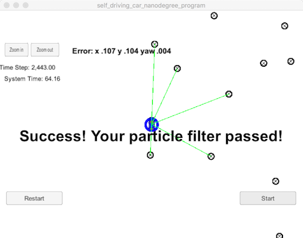

# Kidnapped Vehicle

#### Compiling
##### Code must compile without errors with cmake and make.

``` shell
Softwares-MacBook-Pro:tmp david$ git clone https://github.com/autohandle/CarNDKidnappedVehicleProject.git
Cloning into 'CarNDKidnappedVehicleProject'...
remote: Counting objects: 2622, done.
remote: Compressing objects: 100% (2483/2483), done.
remote: Total 2622 (delta 97), reused 2622 (delta 97), pack-reused 0
Receiving objects: 100% (2622/2622), 426.70 KiB | 1.30 MiB/s, done.
Resolving deltas: 100% (97/97), done.
Softwares-MacBook-Pro:tmp david$ cd CarNDKidnappedVehicleProject/
Softwares-MacBook-Pro:CarNDKidnappedVehicleProject david$ mkdir build
Softwares-MacBook-Pro:CarNDKidnappedVehicleProject david$ cd build
Softwares-MacBook-Pro:build david$ cmake ..
-- The C compiler identification is AppleClang 9.0.0.9000037
-- The CXX compiler identification is AppleClang 9.0.0.9000037
-- Check for working C compiler: /Applications/Xcode.app/Contents/Developer/Toolchains/XcodeDefault.xctoolchain/usr/bin/cc
-- Check for working C compiler: /Applications/Xcode.app/Contents/Developer/Toolchains/XcodeDefault.xctoolchain/usr/bin/cc -- works
-- Detecting C compiler ABI info
-- Detecting C compiler ABI info - done
-- Detecting C compile features
-- Detecting C compile features - done
-- Check for working CXX compiler: /Applications/Xcode.app/Contents/Developer/Toolchains/XcodeDefault.xctoolchain/usr/bin/c++
-- Check for working CXX compiler: /Applications/Xcode.app/Contents/Developer/Toolchains/XcodeDefault.xctoolchain/usr/bin/c++ -- works
-- Detecting CXX compiler ABI info
-- Detecting CXX compiler ABI info - done
-- Detecting CXX compile features
-- Detecting CXX compile features - done
-- Configuring done
-- Generating done
-- Build files have been written to: /tmp/CarNDKidnappedVehicleProject/build
Softwares-MacBook-Pro:build david$ make
Scanning dependencies of target particle_filter
[ 33%] Building CXX object CMakeFiles/particle_filter.dir/src/particle_filter.cpp.o
[ 66%] Building CXX object CMakeFiles/particle_filter.dir/src/main.cpp.o
[100%] Linking CXX executable particle_filter
ld: warning: directory not found for option '-L/usr/local/Cellar/libuv/1.11.0/lib'
[100%] Built target particle_filter
Softwares-MacBook-Pro:build david$ ./particle_filter
Listening to port 4567
Connected!!!
data: <2훼��vcket.io/?EIO=4&transport=websocket HTTP/1.1
user-agent: websocket-sharp/1.0
upgrade: websocket
connection: Upgrade
host: 127.0.0.1:4567
sec-websocket-key: WpqvzQDcW0NqKBrKQHllvQ==
sec-websocket-version: 13

>
```

#### Accuracy
##### The output says "Success! Your particle filter passed!"



#### Performance
##### Runs within the specified time of 100 seconds

The simulation shows a completion time of: 64 seconds. I ran the simulation several times and the maximum finishing time was 95 seconds — that worst-case performance can be viewed in the [video](https://s3.amazonaws.com/autohandle.com/video/CarNDKidnappedVehicleProject.mp4).

#### General
##### Code uses a particle filter and follows the Correct Algorithm


The algorithm is implemented in
[ParticleFilter.cpp](https://github.com/autohandle/CarNDKidnappedVehicleProject/blob/master/src/particle_filter.cpp) and [ParticleFIlter.h](https://github.com/autohandle/CarNDKidnappedVehicleProject/blob/master/src/particle_filter.h).

###### [ParticleFilter::init](https://github.com/autohandle/CarNDKidnappedVehicleProject/blob/24502292382ccf2178b8a5f79b45967ffa671ea8/src/particle_filter.cpp#L23-L49)

The main program first initializes the [ParticleFilter](https://github.com/autohandle/CarNDKidnappedVehicleProject/blob/master/src/particle_filter.cpp) in [ParticleFilter::init](https://github.com/autohandle/CarNDKidnappedVehicleProject/blob/24502292382ccf2178b8a5f79b45967ffa671ea8/src/particle_filter.cpp#L23-L49) with 500 particles in a random state (x,y, and theta) around an initial x,y gps reading,

``` C++
for (int particle = 0; particle < num_particles; ++particle) {
    double sample_x, sample_y, sample_theta;
    
    // TODO: Sample  and from these normal distrubtions like this:
    // sample_x = dist_x(gen);
    // where "gen" is the random engine initialized earlier.
    sample_x=dist_x(gen);
    sample_y=dist_y(gen);
    sample_theta=dist_theta(gen);
    addParticleToFilter(createParticle(sample_x, sample_y, sample_theta));
  }

  is_initialized=true;
```
then the `is_initialized` flag is set so that the main program does not try to initialize [ParticleFilter](https://github.com/autohandle/CarNDKidnappedVehicleProject/blob/master/src/particle_filter.cpp) again.

After initialization, the main program loops through: [ParticleFilter::prediction](https://github.com/autohandle/CarNDKidnappedVehicleProject/blob/24502292382ccf2178b8a5f79b45967ffa671ea8/src/particle_filter.cpp#L58-L98), [ParticleFilter::updateWeights](https://github.com/autohandle/CarNDKidnappedVehicleProject/blob/24502292382ccf2178b8a5f79b45967ffa671ea8/src/particle_filter.cpp#L145-L183), and [ParticleFilter::resample](https://github.com/autohandle/CarNDKidnappedVehicleProject/blob/24502292382ccf2178b8a5f79b45967ffa671ea8/src/particle_filter.cpp#L185-L240).

###### [ParticleFilter::prediction](https://github.com/autohandle/CarNDKidnappedVehicleProject/blob/24502292382ccf2178b8a5f79b45967ffa671ea8/src/particle_filter.cpp#L58-L98)

[ParticleFilter::prediction](https://github.com/autohandle/CarNDKidnappedVehicleProject/blob/24502292382ccf2178b8a5f79b45967ffa671ea8/src/particle_filter.cpp#L58-L98) loops through every particle in the [ParticleFilter](https://github.com/autohandle/CarNDKidnappedVehicleProject/blob/master/src/particle_filter.cpp) updating its state. If the `yaw_rate` is 0, then only the x,y position is updated using the current velocity and time step
``` c++
const double deltaV = delta_t*velocity;
xf = x0 + deltaV*cos(theta0);
yf = y0 + deltaV*sin(theta0);
thetaf = theta0;
```
otherwise, the `yaw_rate` is used to update all three state variables
``` C++
xf = x0 +(velocity/yaw_rate)*(sin(theta0+yaw_rate*delta_t)-sin(theta0));
yf = y0 +(velocity/yaw_rate)*(cos(theta0)-cos(theta0+yaw_rate*delta_t));
thetaf = theta0+yaw_rate*delta_t;
```
In both cases, noise is added to all the state variables
``` C++
normal_distribution<double> noisyXf(xf, std_pos[0]);
normal_distribution<double> noisyYf(yf, std_pos[1]);
normal_distribution<double> noisyThetaf(thetaf, std_pos[2]);

particle.x=noisyXf(gen);
particle.y=noisyYf(gen);
assert(!std::isnan(particle.y) && !std::isnan(particle.y));
particle.theta=noisyThetaf(gen);
```
After the particle states have been updated, the accuracy/weight of each particle at the new/predicted location can be calculated.

###### [ParticleFilter::updateWeights](https://github.com/autohandle/CarNDKidnappedVehicleProject/blob/24502292382ccf2178b8a5f79b45967ffa671ea8/src/particle_filter.cpp#L145-L183)

First, the list of all landmarks is reduced in [filterLandmarkMap](https://github.com/autohandle/CarNDKidnappedVehicleProject/blob/24502292382ccf2178b8a5f79b45967ffa671ea8/src/particle_filter.h#L94-L108) by using the `sensor_range` and the particle's new/predicted location
```C++
if (fabs(fabs(landmarkInMap.x_f)-fabs(theParticle.x))<theSensorRange && fabs(fabs(landmarkInMap.y_f)-fabs(theParticle.y))<theSensorRange) {
  LandmarkObs landmarkInRange;
  landmarkInRange.id=landmarkInMap.id_i;
  landmarkInRange.x=landmarkInMap.x_f;
  landmarkInRange.y=landmarkInMap.y_f;
  landmarksInSensorRange.push_back(landmarkInRange);
}
```
Then, assuming each particle is where the current `observations` were actually made, the `observations` vector is transformed into map coordinates by using each particle x,y,theta position in [transform](https://github.com/autohandle/CarNDKidnappedVehicleProject/blob/24502292382ccf2178b8a5f79b45967ffa671ea8/src/particle_filter.h#L45-L66) to translate and rotate each observation.
``` C++
LandmarkObs* const inMapCoordinates = new LandmarkObs;
(*inMapCoordinates).id=-1;// flag landmark as unlinked
(*inMapCoordinates).x = particleX+cos(theRoationfromCarToParticle)*observationX-sin(theRoationfromCarToParticle)*observationY;
(*inMapCoordinates).y = particleY+sin(theRoationfromCarToParticle)*observationX+ cos(theRoationfromCarToParticle)*observationY;
return (*inMapCoordinates);
```
The transformed observations and the reduced landmark list are used by [ParticleFilter::dataAssociation](https://github.com/autohandle/CarNDKidnappedVehicleProject/blob/24502292382ccf2178b8a5f79b45967ffa671ea8/src/particle_filter.cpp#L100-L120) to link each transformed observation to the closest landmark.
``` C++
LandmarkObs& landmark = theLandmarks[lm];
const double distanceToLandmark=dist(landmark.x, landmark.y, prediction.x, prediction.y);
if (distanceToLandmark<bestDistance) {
  // different prediction can point to the same landmark
  prediction.id=lm;// attach this prediction to this landmark
  //std::cout << "prediction:" << prediction.id << ", landmark:" << landmark.id << std::endl;
  bestDistance=distanceToLandmark;
} // end if better distance
```
The `LandmarkObs.id` field is used to hold the vector index of the closest landmark to the observation.

Once the observations for each particle are linked to the nearest landmark, then the weight (or likelihood that the particle is at the actual vehicle location) can be calculated by [ParticleFilter::particleWeight](https://github.com/autohandle/CarNDKidnappedVehicleProject/blob/24502292382ccf2178b8a5f79b45967ffa671ea8/src/particle_filter.h#L68-L92)
```C++
const double sigmaX=theObservationMeasurementSigmas[0];
const double sigmaXSquared = sigmaX*sigmaX;
const double sigmaY=theObservationMeasurementSigmas[1];
const double sigmaYSquared = sigmaY*sigmaY;
const double xDiff=theTransformedObservation.x-theLandmark.x;
const double xDiffSquared=xDiff*xDiff;
const double yDiff=theTransformedObservation.y-theLandmark.y;
const double yDiffSquared=yDiff*yDiff;

return (1./(2*M_PI*sigmaX*sigmaY))*exp(-1.*((xDiffSquared/(2.*sigmaXSquared)) + (yDiffSquared/(2.*sigmaYSquared))) );
```
using the [multivariate normal distribution](https://en.wikipedia.org/wiki/Multivariate_normal_distribution) for the x and y components. Weights for each observations are treated independent and are multiplied together
```C++
double cummulativeWeight=1.0;
for (int obs=0; obs<theTransformedObservations.size(); obs++) {
  const LandmarkObs& observation = theTransformedObservations[obs];
  assert((observation.id>=0) && (observation.id<theLandmarks.size()));// observation.id==-1 -> not linked to a landmark
  const LandmarkObs& landmark = theLandmarks[observation.id];
  const double landmarkObservationWeight = particleWeight(landmark, observation, theObservationMeasurementSigmas);
  cummulativeWeight*=landmarkObservationWeight;
}
```
After the observations are transformed for each particle, linked to the nearest landmark, and then used to update the particle weight — the list of particles is sampled to increase the number of particles that have a highest weight and proportionally reduce the others.

###### [ParticleFilter::resample](https://github.com/autohandle/CarNDKidnappedVehicleProject/blob/24502292382ccf2178b8a5f79b45967ffa671ea8/src/particle_filter.cpp#L185-L240)

First, all the zero weight particles are culled and the `totalWeight` for all the nonzero particles is calculated
``` C++
std::vector<Particle> particlesToResample;
double totalWeight=0.;
for (int p=0; p<particles.size();p++) {
  Particle& particle = particles[p];
  if (isParicleWeightGreaterThanZero(particle)) {
    totalWeight+=particle.weight;
    particlesToResample.push_back(particle);
  }
}
```
with the `totalWeight` and the weight of each nonzero particle, a `cummulativeParticleProbability` vector can be built
``` C++
double cummulativeProbability=0.;
for (int p=0; p<particlesToResample.size();p++) {
  const Particle& particle = particlesToResample[p];
  const double particleProbabilty=particle.weight/totalWeight;
  cummulativeProbability+=particleProbabilty;
  //cummulativeParticleProbability[p]=cummulativeProbability;
  cummulativeParticleProbability.push_back(cummulativeProbability);

}
```
With a `cummulativeParticleProbability` vector and a uniform 0—1 random number generator, the nonzero particles can be sampled proportional to their weight.
``` C++
std::uniform_real_distribution<double> distribution(0.,1.);
std::vector<Particle> resamples;
for (int p=0; p<num_particles;p++) {// forall particle slots in the original number of samples
  const double randomProbability = distribution(gen);
  int cpi=0;
  while (cummulativeParticleProbability[cpi]<randomProbability) {
    cpi+=1;
    //cout << "randomProbability:" << randomProbability << ", cummulativeParticleProbability[" << cpi << "]:" << cummulativeParticleProbability[cpi] << std::endl;
  }
  resamples.push_back(particlesToResample[cpi]);
}
```

#### Video Implementation

[Kidnapped Vehicle Project](https://s3.amazonaws.com/autohandle.com/video/CarNDKidnappedVehicleProject.mp4)

The video was created by using a [screen recording tool](http://www.idownloadblog.com/2016/02/26/how-to-record-part-of-mac-screen-quicktime/).

